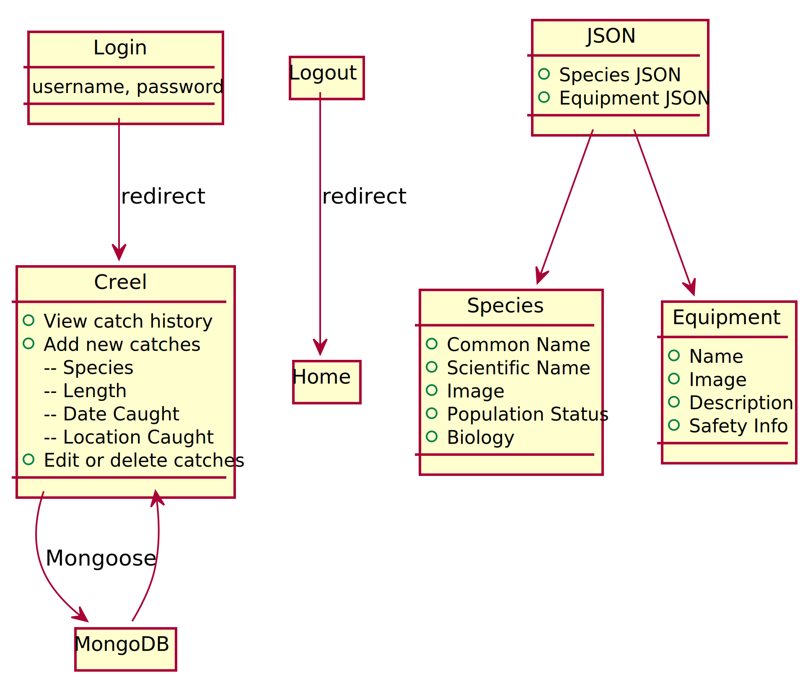

# Rockfish Conservation

## Purpose
Rockfish is a vulnerable fish family that is being overfished by commercial and game fishing, with several species on the endangered or threatened list. Several agencies are invested in the conservation awareness efforts. Since rockfish live in deep water, they often experience barotrauma when they are caught. An important part of awareness is to educate the fishing community about species identification and safe catch-and-release methods to protect species that are most vulnerable.

[Check it out!](https://rockfish-conservation.herokuapp.com/)

## Project Requirements
* ReactJS
* Node and Express Web Server
* MySQL or MongoDB database with a Sequelize or Mongoose ORM
* Include both GET and POST routes for retrieving and adding new data
* Deployed using Heroku (with Data)
* Utilize at least 2 libraries, packages, or technologies which has not been discussed in class
* Allow for or involve authentication of users in some way
* Polished frontend/UI
* Folder structure that meets MVC Paradigm
* Meet good quality coding standards (indentation, scoping, naming)
* Must not expose sensitive API key information on the server

## Plan, Design and Research
**_Intended Application/Value of the Application_**
* Provide rockfish conservation awareness to users.
* Educate users on rockfish identification.
* Educate proper catch and release procedures to users.

#### **_Design Layouts_**

##### Site Architecture

##### Data Flow 

#### **_Collaborator Roles_**

Aaron Bertagnole:  Creel Page/database

Riley Chatwin: Fishing Page

Megan Swenson: Front-end design, Home Page

Mark Syphus:  Fish technical information, provide content for each page, diagrams, Authentication system, debugging

Chiafong Tsao: Species Page, Fish Game, Navbar, Footer

**When finished with own tasks or blocked, help others with their tasks.

#### **_Project Schedule_**

_Available on project board._

## Technologies Used
* Axios
* Bcryptjs
* Body-Parser
* Classnames
* Concurrently
* Dotenv
* Express
* Heroku
* If-env
* Is-empty
* JSONWebToken
* JWT-decode
* MongoDB
* Mongoose.js
* Node.js
* Nodemon
* Passport.js with Passport-jwt
* Path
* Prop-types
* React.js
* React-bootstrap
* React-dom
* React-responsive
* React-redux
* React-router-dom
* React-scripts
* Redux
* Redux-thunk
* UML/Plant UML
* Validator
* Video-react

*URL's showing where the fish images are from can be found in the [fish.json](./src/fish.json) file.  Fishing equipment images were clipped from various government and shopping sites.*

*Shout out to Rishi Prasad for the helpful [tutorial](https://blog.bitsrc.io/build-a-login-auth-app-with-mern-stack-part-1-c405048e3669) on building a Login/Authentication App with the MERN stack that set the base for our authentication system.

