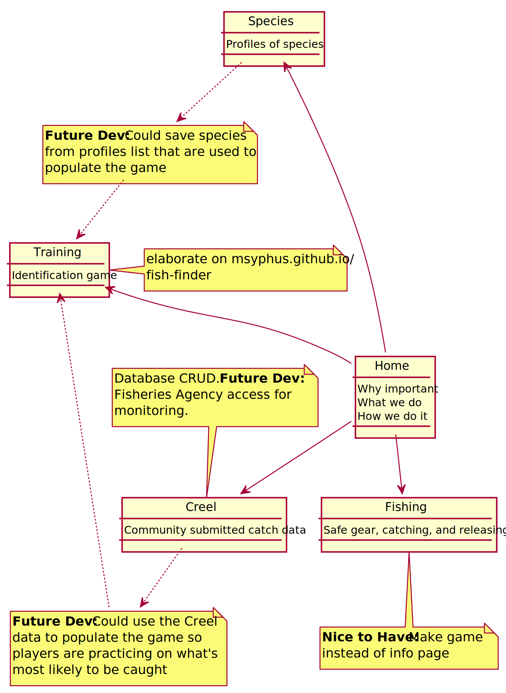

# rockfish-conservation

## Purpose
Rockfish is a vulnerable fish specie that is being overfished by commercial and game fishing, with several species on the endangered or threatened list. Several agencies are invested in the conservation awareness efforts. Since rockfish live in deep water, they often experience barotrauma when they are caught. An important part of awareness is to educate the fishing community about species identification and safe catch-and-release methods to protect species that are most vulnerable.
## Project Requirements
* ReactJS
* Node and Express Web Server
* MySQL or MongoDB database with a Sequelize or Mongoose ORM
* Include both GET and POST routes for retrieving and adding new data
* Deployed using Heroku (with Data)
* Utilize at least 2 libraries, packages, or technologies which has not been discussed in class
* Allow for or involve authentication of users in some way
* Polihed frontend/UI
* Folder structure that meets MVC Paradigm
* Meet good quality coding standards (indentation, scoping, naming)
* Must not expose sensitive API key information on the server

## Plan, Design and Research
**_Intended Application/Value of the Application_**
* Provide rockfish conservation awareness to users.
* Educate users on rockfish identification.
* Educate proper catch and release procedures to users.

**_Design Layouts_**

Potential approach:
* One person does Species and Training Page
* One person does Home Page and templating for site design
* One person does Creel Page
* One person does Regulations and Fishing Page
* Mark floats across all pages for fish info and general help

**_Collaborator Roles_**

Aaron Bertagnole:

Riley Chatwin:

Megan Swenson:

Mark Syphus:  Fish technical information

Chiafong Tsao: Species/Training page; Navbar

**_Project Schedule_**

## Technologies Used
* ReactJS
* Node/Express Web Server
* MongoDB/Mongoose ORM
* MySQL/Sequelize
* Heroku
* UML/Plant UML

